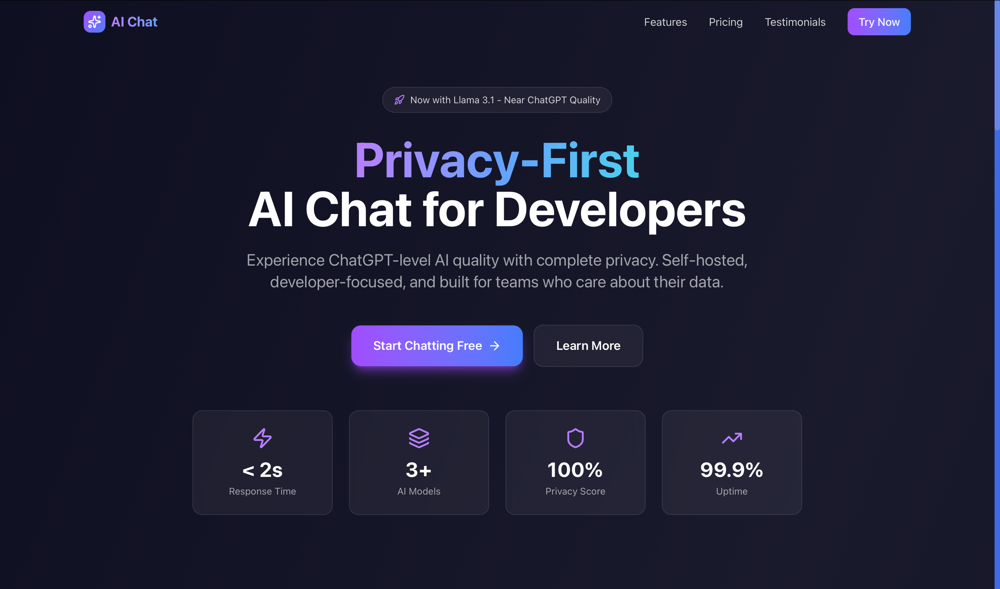
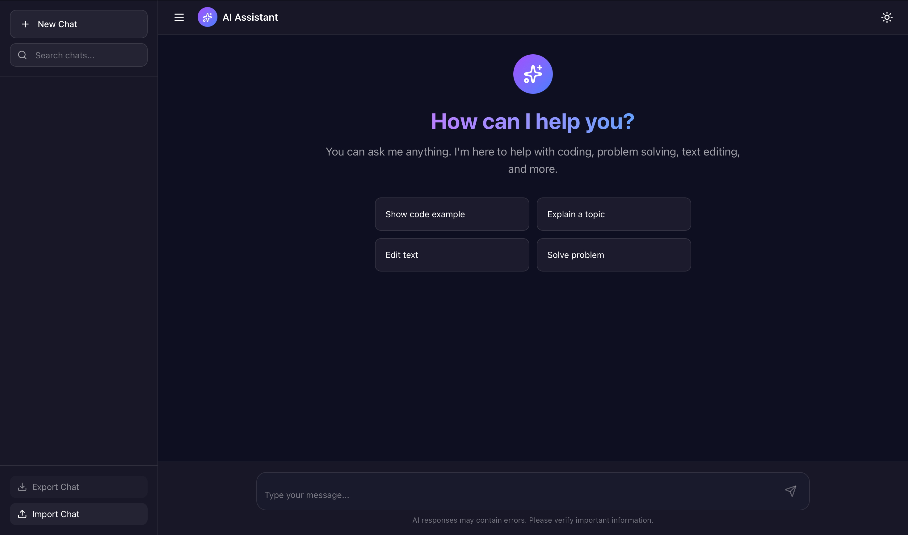
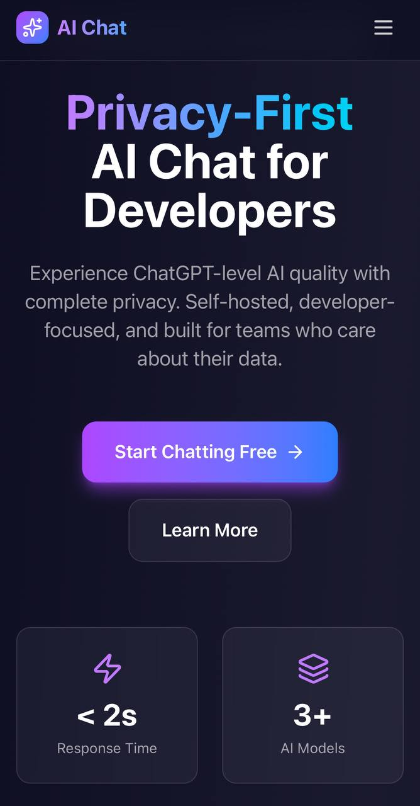
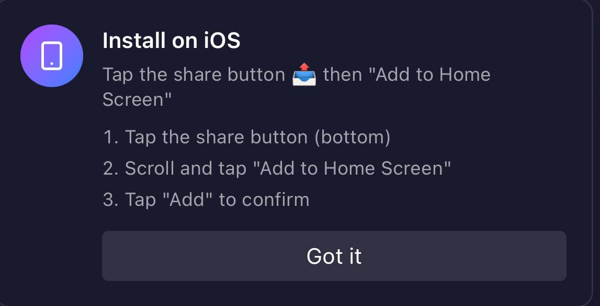

# 🤖 AI Chat Assistant

# 🤖 AI Chat Assistant

**A modern, privacy-first AI chat application built with Next.js 15 and React 19**

[Features](#-features) • [Demo](#-demo) • [Tech Stack](#-tech-stack) • [Screenshots](#-screenshots)

**⭐ Star this repo if you find it useful!**

**🔒 Closed Source Project**

---

## 📸 Screenshots

### Landing Page

### Chat Interface

### Mobile View

### PWA Installation

---

## ✨ Features

### 🤖 AI Capabilities
- **Multiple AI Models**: Support for Llama 3.1, Mistral, Qwen, and more via HuggingFace
- **Smart Prompt Engineering**: Advanced system prompts, chain-of-thought reasoning, and task detection
- **Streaming Responses**: Real-time AI responses with streaming technology
- **Conversation Context**: AI remembers previous messages in the conversation

### 💬 Chat Management
- **Multiple Sessions**: Create and manage unlimited chat sessions
- **Search & Filter**: Quickly find conversations with search functionality
- **Export/Import**: Export chat history as JSON or import previous conversations
- **Edit & Delete**: Edit message titles and delete conversations
- **Regenerate**: Regenerate AI responses with a single click

### 🎨 User Experience
- **Modern UI**: Beautiful dark/light theme with smooth animations
- **Markdown Support**: Rich markdown rendering with syntax highlighting
- **Code Highlighting**: Beautiful code blocks with syntax highlighting
- **Keyboard Shortcuts**: Power user shortcuts for faster navigation
- **Toast Notifications**: User-friendly notifications for all actions
- **Responsive Design**: Perfect experience on mobile, tablet, and desktop

### 📱 Progressive Web App (PWA)
- **Installable**: Install as a native app on Android, iOS, Windows, macOS, and Linux
- **Offline Support**: UI works offline (cached), AI requires internet
- **Standalone Mode**: Runs like a native app without browser UI
- **Fast Loading**: Service worker caching for instant load times

### 🔒 Security & Performance
- **Rate Limiting**: Built-in rate limiting to prevent API abuse
- **Input Validation**: XSS protection and message sanitization
- **Error Handling**: Comprehensive error handling with retry mechanism
- **API Timeout**: 30-second timeout with automatic retry (exponential backoff)
- **Type Safety**: Full TypeScript support for type-safe development

---

## 🛠️ Tech Stack

- **Framework**: [Next.js 15](https://nextjs.org/) (App Router)
- **UI Library**: [React 19](https://react.dev/)
- **Styling**: [Tailwind CSS 4](https://tailwindcss.com/)
- **AI API**: [HuggingFace Inference API](https://huggingface.co/inference-api)
- **Markdown**: [react-markdown](https://github.com/remarkjs/react-markdown) + [remark-gfm](https://github.com/remarkjs/remark-gfm)
- **Syntax Highlighting**: [react-syntax-highlighter](https://github.com/react-syntax-highlighter/react-syntax-highlighter)
- **Icons**: [lucide-react](https://lucide.dev/)
- **Type Safety**: [TypeScript](https://www.typescriptlang.org/)
- **Testing**: [Jest](https://jestjs.io/) + [React Testing Library](https://testing-library.com/)

---

## 🌐 Demo

**Live Demo**: [Visit the application](https://ai-chattt.vercel.app)

> **Note**: This is a closed-source project. Source code is not publicly available.

---

## 🏗️ Architecture Overview

This application is built with a modern, scalable architecture:

- **Frontend**: Next.js 15 with App Router, React 19, TypeScript
- **Backend**: Next.js API Routes (serverless functions)
- **AI Integration**: HuggingFace Inference API
- **State Management**: React Hooks + LocalStorage
- **Styling**: Tailwind CSS 4 with custom design system
- **PWA**: Service Worker, Web App Manifest, Offline Support

---

## 🎯 How to Use

### Getting Started

1. **Visit the Application**: Open the live demo link above
2. **Start Chatting**: Click "Try Now" or navigate to the chat page
3. **Send Messages**: Type your message and press `Enter`
4. **Manage Chats**: Create multiple chat sessions, search, edit, or delete them

### Key Features

- **Multiple Sessions**: Organize your conversations into separate chat sessions
- **Smart AI**: Advanced prompt engineering for better responses
- **Real-time Streaming**: See AI responses as they're generated
- **Markdown Support**: Rich formatting with code highlighting
- **Keyboard Shortcuts**: Power user shortcuts for faster navigation
- **PWA Support**: Install as a native app on any device
- **Theme Toggle**: Switch between dark and light modes
- **Export/Import**: Backup and restore your chat history

### PWA Installation

#### Android (Chrome/Edge)
1. Visit the site in Chrome
2. An "Install App" banner will appear
3. Click "Install" to add to home screen

#### iOS (Safari)
1. Visit the site in Safari
2. Tap the Share button (bottom)
3. Select "Add to Home Screen"
4. Tap "Add" to confirm

---

## 🚀 Performance

- **Fast Loading**: Optimized bundle size, code splitting, lazy loading
- **Streaming**: Real-time AI responses with streaming technology
- **Caching**: Service worker caching for offline support
- **Responsive**: Works seamlessly on all devices
- **Type-Safe**: Full TypeScript support for reliability

---

## 🔒 Security Features

- ✅ **Rate Limiting**: Prevents API abuse (20 requests per minute)
- ✅ **Input Validation**: XSS protection and message sanitization
- ✅ **Error Handling**: Comprehensive error handling with user-friendly messages
- ✅ **API Timeout**: 30-second timeout with automatic retry
- ✅ **Type Safety**: Full TypeScript support
- ✅ **Content Security Policy**: CSP headers for additional security

---

## 📱 PWA Features

- ✅ **Installable**: Works on all major platforms
- ✅ **Offline UI**: Interface works offline (cached)
- ✅ **Fast Loading**: Service worker caching
- ✅ **Standalone Mode**: Runs like a native app
- ✅ **App Icons**: Custom icons for all platforms

**Note**: AI responses require internet connection. UI is cached and works offline.

---

## 📝 Important Notes

- **AI Responses**: Responses come from HuggingFace API. Please verify important information.
- **Chat History**: Stored in browser's localStorage. Clearing browser data will delete history.
- **Privacy**: All data is stored locally. No tracking, no analytics, no data collection.
- **Offline Support**: UI works offline, but AI responses require internet connection.

---

## 🔒 Privacy & Security

- ✅ **No Tracking**: Zero analytics, zero tracking
- ✅ **Local Storage**: All data stored in your browser
- ✅ **No Backend**: No server-side data storage
- ✅ **Secure**: Rate limiting, input validation, XSS protection
- ✅ **Open Standards**: Built with open web technologies

---

## 📄 License

This project is **closed source** and proprietary. All rights reserved.

---

## 🙏 Acknowledgments

Built with amazing open-source technologies:

- [Next.js](https://nextjs.org/) - The React Framework
- [HuggingFace](https://huggingface.co/) - AI Models & Inference API
- [React](https://react.dev/) - UI Library
- [Tailwind CSS](https://tailwindcss.com/) - Styling Framework
- [TypeScript](https://www.typescriptlang.org/) - Type Safety

---

## ⭐ Like this project? Give it a star!

**Star this repo to show your support!** ⭐

---

**Built with ❤️ using Next.js, React, and TypeScript**

**🔒 Closed Source Project**

[Live Demo](#-demo) • [Contact](#) • [Privacy Policy](#)

